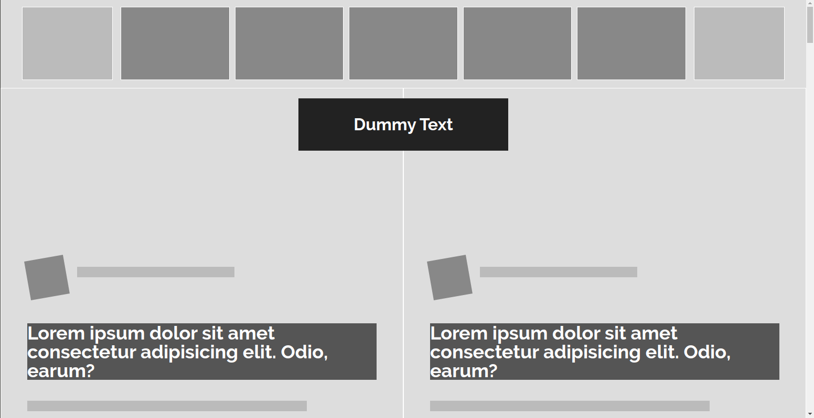

# Grayscale Heat Map - Smashing Magazine Website Evaluation

> This is a grayscale heat map of the [Smashing Magazine Website](https://www.smashingmagazine.com/), created to practice design principles and CSS positioning.

## Features

- Grayscale heat map based on four shades of gray
- Greatest weight in the visual hierarchy has darker gray shades.
- Positioning using flex and grid
- Font import inside HTML
- Main focus in containers, not in content

## Built With

- HTML5
- CSS3: Grid, Flexbox

## Live Demo

[Smashing Magazine Heat Map](https://smashing-magazine-heatmap.netlify.com/)

## Authors

👤 **Felipe Augusto Rosa**

- Github: [@flpfar](https://github.com/flpfar)
- Twitter: [@flpfar](https://twitter.com/flpfar)
- Linkedin: [Felipe Augusto Rosa](https://www.linkedin.com/in/felipe-augusto-rosa-7b96a4b1)

👤 **Sunday Uche Ezeilo**

- Github: [@sundayezeilo](https://github.com/ezeilo-su)
- Twitter: [@SundayEzeilo](https://twitter.com/SundayEzeilo)
- Linkedin: [Sunday Ezeilo](https://www.linkedin.com/in/sunday-ezeilo-a6a67664/)

## 🤝 Contributing

Contributions, issues and feature requests are welcome!

Feel free to check the [issues page](issues/).

## Show your support

Give a ⭐️ if you like this project!